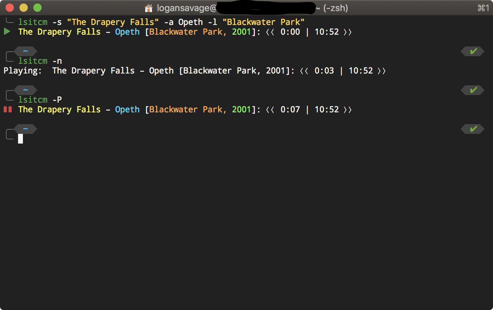

# LSITCM

**Note**: MacOS Catalina support is coming in 2.0.0 (this version).

### Install

`sudo npm i -g lsitcm`

### What is it?

LSITCM is a module for controlling iTunes on MacOS. It utilizes AppleScript to control the iTunes player to play a song, pause/play, skip a song, and play the previous song.

### Why use it?

Inside of external utilities such as SSH, the graphical portition of the host is not available, and only a console (bash) window is available. With the ability to control iTunes through the system console, it extends the capabilities of utilizing MacOS.

### How to use it?

LSITCM has 3 main uses (as of now):
1. Play a specific song:
  - `lsitcm -s [SONG NAME] -a [ARTIST NAME] -l [ALBUM NAME]`
2. Show the playing status of iTunes:
  - `lsitcm`
3. Control iTunes' flow:
  - `lsitcm -P` Pause
  - `lsitcm -N` Next song
  - `lsitcm -R` Previous song
###### UPDATE (v1.0.3): This module has been demoted back to just a CLI, to reduce overhead for its original purpose. To access the underlying APIs, look inside the *lib* folder for `itunes.js` and its corresponding AppleScript.
